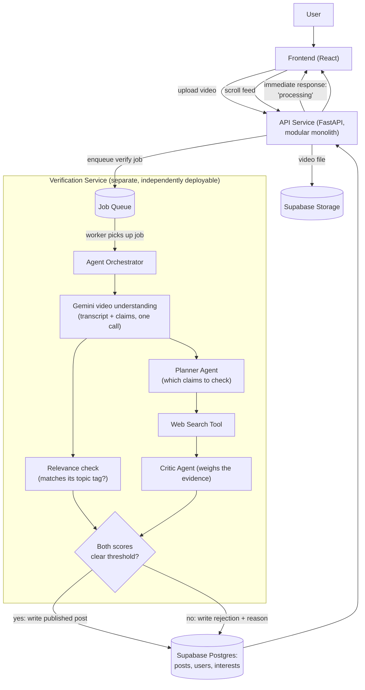

# TrustFeed — High-Level Design

**Status:** Draft (Milestone 0) · **Last updated:** 2026-09-12

## What this is

TrustFeed is a content feed you actually control: instead of an algorithm
optimizing for how long it can keep you scrolling, you tell it what topics
you want. Users upload their own short videos; before a video is allowed
into the shared feed, a small team of AI agents checks it against two
gates — is it actually about the topic it claims (**relevance**), and are
its factual claims supported by outside sources (**credibility**) — and
everyone scrolls a feed of what other users have posted, filtered by
interest, with a plain-language verdict ("Well Supported," "Mixed
Evidence," "Unsupported," or "Unable to Verify") attached to each post.

## In scope vs. out of scope (MVP)

**In scope:**
- Real user accounts, and users uploading their own short videos
- Gemini native video understanding at upload time (transcript + relevance + claims, one call — see [ADR 0002](decisions/0002-user-generated-content.md))
- A two-gate check before publishing: relevance score + credibility score, both must clear a threshold
- A shared, scrollable feed of published posts from all users, filtered by the viewer's chosen interests
- The full verification pipeline: claim extraction → search → evidence weighing → verdict
- A real, deployed frontend + backend

**Deliberately out of scope for now** (not forgotten — see the decision log):
- Scraping real platforms like Instagram/TikTok (Terms-of-Service and legal risk) — content only ever arrives via users uploading it themselves through TrustFeed
- A children's/parental-control mode (real privacy-law weight, little engineering payoff for a solo MVP)
- A from-scratch machine-learning recommender system (simple tag/interest matching is enough — the verification pipeline is the point)
- A full content-moderation system for abuse/spam/illegal content — a real launch would need this, but it's a separate concern from fact-checking and out of scope for the solo build (see ADR 0002, Consequences)

## How a request flows through the system

In plain words — this is now **two separate services** talking through a queue, not one program:

1. **Frontend** — what you actually see and click; a React app. Two main things happen here: uploading your own video, and scrolling a feed of everyone else's.
2. **API Service** — the door between the frontend and everything else; a modular monolith (see ADR 0001) handling uploads, the feed, and users. When a video is uploaded, it stores the file and immediately responds "processing" — it does **not** wait for verification to finish.
3. **Supabase Storage** — where the actual uploaded video file is kept.
4. **Job Queue** — the hand-off point between the two services. The API drops a "verify this video" job here and moves on; it doesn't call the Verification Service directly.
5. **Verification Service** — a separate service whose only job is the slow work: it picks up jobs from the queue whenever it's free, so a burst of uploads or a slow AI call never blocks the main app.
6. **Gemini video understanding** — reads the video directly (video + audio together) and returns a transcript, a read on what topic it's actually about, and the factual claims worth checking — all in one call.
7. **Relevance check** — compares what the video's actually about to the topic the uploader tagged it with.
8. **Planner → Web Search → Critic Agent** — the same verification chain as before: decide what to check, gather evidence, weigh it into a verdict instead of a blunt true/false.
9. **The gate** — a post only reaches the feed if *both* the relevance score and the credibility score clear their thresholds; otherwise the database records which one failed, so the uploader can be told why.
10. **Supabase Postgres** — stores users, their interests, and every published (or rejected) post plus its scores — shared by both services, this is also what the feed is read from.

## Key architecture decisions

| Decision | Choice | Full reasoning |
|---|---|---|
| Overall shape | API Service = modular monolith; Verification Service split out separately, connected by a job queue | [ADR 0001](decisions/0001-mvp-architecture.md), [ADR 0003](decisions/0003-verification-service-split.md) |
| Frontend | React (Vite) | [ADR 0001](decisions/0001-mvp-architecture.md) |
| Storage + database + auth | Supabase (Storage, Postgres, Auth) | [ADR 0002](decisions/0002-user-generated-content.md) |
| Video understanding | Gemini native video (one multimodal call) | [ADR 0002](decisions/0002-user-generated-content.md) |
| Upload gate | Two separate scores (relevance + credibility), not one blended number | [ADR 0002](decisions/0002-user-generated-content.md) |
| Verification pipeline | Its own service, decoupled via a job queue (queue technology TBD at that milestone) | [ADR 0003](decisions/0003-verification-service-split.md) |
| Hosting | Render (backend) + Vercel (frontend) | [ADR 0001](decisions/0001-mvp-architecture.md) |

## Milestone roadmap

| # | Milestone | What it proves | Concepts used |
|---|---|---|---|
| 0 | Project setup + this HLD | The shape of the whole system is agreed before code | — |
| 1 | ✅ Claim-verification core, text only (CLI or bare script) | The hardest, riskiest part — Planner → Search → Critic — works at all | Multi-agent, RAG, tool calling |
| 2 | ✅ Extend the core to video (still a script, a local video file in → verdict out) | Gemini native video understanding works: transcript + relevance + claims in one call | Multimodal AI |
| 3 | ✅ Turn the script into the Verification Service: a real, independently-runnable service that takes jobs off a queue (tested) | It's a real service, not a script — and the first genuine service boundary in the project | Production habits, automated tests, job queues |
| 4a | ✅ Build the API Service + Supabase integration: storage + Postgres + auth + enqueueing verification jobs | Real uploads, real accounts, real persistence, two services talking through a queue | Auth, file storage, Postgres, service-to-service communication |
| 4b | ✅ The actual publish/reject gate: score relevance against the declared topic, combine with credibility into one decision | The core product idea — a post only reaches the feed if it earns it | Structured judgment calls, decision rules |
| 5 | ✅ Minimal frontend: upload a video, see the gate result (with a "processing" state while it waits); scroll the shared feed | Frontend ↔ backend integration works end-to-end, including the async wait | React basics |
| 6 | ✅ Interest-based filtering on top of the feed | The "feed" idea properly, without a full recommender system | Tagging / embedding similarity |
| 7a | ✅ MCP tool server: the Critic's search tool moves from a direct function call to a real MCP server | Same architectural step as phase3-multiagent, applied to the real pipeline | MCP |
| 7b | ✅ Live step-by-step streaming to the UI (Redis pub/sub + SSE) | The most impressive demo moment — watch the agent work, not a static spinner | Streaming, pub/sub |
| 8a | ✅ Search result caching (Redis) + injection-resistant prompts, tested against real adversarial claims | Real cost/latency savings on repeats, and a real defense for a real risk (untrusted user + web content in prompts) | Caching, guardrails |
| 8b | ✅ Human-in-the-loop: borderline gate decisions get a `needs_review` status instead of an automatic call | Not every decision should be fully automatic | Decision rules, escalation |
| 8c | CI: automated tests on every push (fast tests only, not the LLM-calling ones) | Ready to show, not just run on a laptop | CI, test hygiene |

Each milestone gets its own plan (options, scope, cons) and LLD before it's
built — new decisions get added to the decision log as they're made.

## Open Questions / Things to Revisit

- ~~What's a sensible default threshold for the gates~~ — **Decided at
  Milestone 4b:** relevance score must be ≥ 50 (a starting judgment call,
  not yet tuned on real data); credibility is strict — any single
  `Unsupported` claim fails the post regardless of relevance. See
  `docs/milestones/milestone-4b-publish-gate.md`.
- Gemini's video upload size/length limits haven't been checked yet —
  needs confirming before Milestone 2's design gets finalized.
- What happens to a rejected upload — silently discarded, or kept private
  to the uploader with the rejection reason shown? **Effectively decided
  at Milestone 4b:** it's kept (status `rejected` with `rejection_reason`
  on the same row the uploader can already read via `GET /posts/{id}`) —
  not yet exposed nicely in any UI since there isn't one until Milestone 5.
- ~~Which job queue technology~~ — **Decided at Milestone 3:** Upstash
  Redis (hosted, standard Redis protocol, real blocking waits). A
  Postgres-backed queue was ruled out for now since Supabase doesn't exist
  until Milestone 4 — see `docs/milestones/milestone-3-verification-service.md`.
- ~~How does the frontend know a "processing" post has finished~~ —
  **Decided at Milestone 5:** polling (every 4s while anything is still
  processing), not Supabase Realtime — simpler, and the "watch it happen
  live" moment is Milestone 7's job. Confirmed working in a real browser.
- Videos are served via a temporary signed URL generated per-request
  (Milestone 5) since the Storage bucket is private — fine at this
  scale; a CDN/caching strategy for signed URLs is a Milestone 8 concern
  if this ever needs to handle real traffic.
