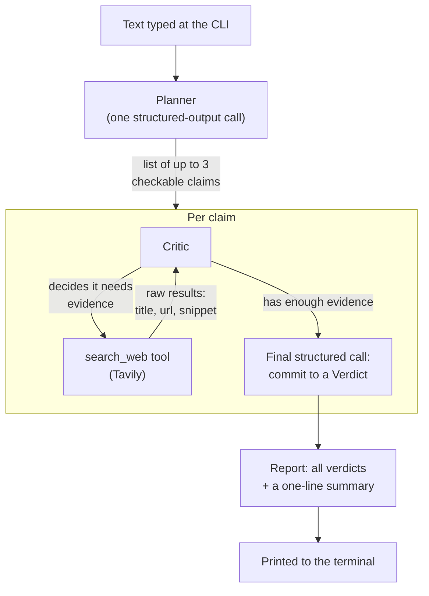

# Milestone 1 — Claim-Verification Core (LLD)

**Status:** Done · **Depends on:** nothing (first real code) · **Produces:** `backend/app/agents/`, `backend/tests/`

## What this milestone proves

You give it a short piece of text on the command line; it hands back a
plain-language credibility verdict for each factual claim in that text,
with sources. No frontend, no video, no accounts, no queue — just the
riskiest, most important part of the whole project working at all.

## How it works, step by step

1. **Planner** — one Gemini call, no tools. Reads the input text and
   returns a short list (up to 3) of distinct, checkable *factual* claims,
   skipping opinions ("this is the best pizza") and rhetorical statements.
   If it finds none, the pipeline says so and stops — not every input has
   something to fact-check.
2. **Critic, per claim** — this is a small reason → act → observe loop,
   the exact same shape as `phase1-agent`'s calculator loop, except the one
   tool available is `search_web` (backed by Tavily). The model decides
   what to search for, can search more than once if the first result is
   thin or ambiguous, and stops once it has enough to judge. Capped at 3
   turns so a confused run can't loop forever or rack up cost — same
   safety habit as `phase1-agent`'s `MAX_TURNS`.
3. **Commit step** — once the Critic is done researching, one more clean
   call (no tools this time, structured output only) forces the model to
   commit to one of exactly four labels — **Well Supported / Mixed
   Evidence / Unsupported / Unable to Verify** — plus a short
   plain-language explanation and the source links it actually used. Doing
   this as a separate call keeps "research freely" and "now commit to a
   strict answer shape" from fighting each other in one call.
4. **Report** — all verdicts get collected, plus a one-line summary (e.g.
   "2 of 3 claims well supported, 1 unsupported"), and printed.

## Files this creates

| File | Plain-language job |
|---|---|
| `backend/app/core/config.py` | Loads `.env`, fails with a clear message if `GEMINI_API_KEY` or `TAVILY_API_KEY` is missing (same pattern as the existing phase scripts) |
| `backend/app/agents/models.py` | The data shapes: a `Source` (title/url/snippet), a `Verdict` (claim/label/explanation/sources), a `Report` (all verdicts + summary) |
| `backend/app/agents/search_tool.py` | The `search_web` function (calls Tavily) and its tool description (schema) the model reads to know the tool exists |
| `backend/app/agents/planner.py` | The claim-extraction call |
| `backend/app/agents/critic.py` | The research loop + the final commit call |
| `backend/app/agents/pipeline.py` | Wires Planner → Critic (per claim) → Report together |
| `backend/app/cli.py` | `python -m app.cli "some text"` — the actual runnable entry point |
| `backend/tests/golden_claims.py` | ~8 hand-picked claims with a known expected answer (clearly true, a classic myth, misinformation, an opinion with zero claims, a genuinely nuanced one) |
| `backend/tests/test_golden_set.py` | Runs the real pipeline against the golden set and checks the labels land where expected |
| `backend/requirements.txt`, `backend/.env.example` | Dependencies and the two API keys needed |

## New account you'll need

**Tavily** (the search tool) needs its own free API key — sign up at
tavily.com, free tier is ~1,000 searches/month, plenty for this milestone.
I'll tell you exactly where it goes once we're implementing.

## Honest cons of this design

- The golden-set test makes real Gemini + Tavily calls — it costs a small
  amount and takes real time (not instant), unlike a normal mocked unit
  test. That's intentional (Phase 4's "test the real non-deterministic
  system," not a mock that could hide a real break) but means it's a
  "run when you mean it" test, not one to run in a tight loop. Caching
  (Milestone 8) will make repeat runs cheaper later.
- A 3-claim, 3-search-turn cap is a judgment call, not a proven number —
  fine for proving the pipeline works, likely to need tuning once we see
  real behavior.
- Nuanced claims (health, economics, anything with genuine expert
  disagreement) are the hardest case for this design and the most likely
  place the Critic's verdict will be debatable — expected, and part of why
  "Mixed Evidence" and "Unable to Verify" exist as honest outs instead of
  forcing true/false.

## Definition of done

- [x] `python -m app.cli "<some text>"` runs end-to-end and prints a report
- [x] All golden-set claims land on their expected label
- [x] Running it on a pure-opinion sentence correctly reports zero checkable claims

## What actually happened, building this

- **A real API rule we hit:** Gemini's `generate_content` rejects a
  request whose conversation ends on the model's own turn — you must end
  on a user turn. This showed up because the research loop's last message
  is sometimes the model's own plain-text research summary. Fixed by
  explicitly appending a "now commit to your final verdict" user message
  before the commit call — which turned out to be good prompting anyway,
  not just a technical workaround.
- **A real golden-set finding, not a bug:** the classic "Great Wall is
  visible from space" myth came back as "Mixed Evidence" instead of the
  expected "Unsupported," because the Critic's search genuinely surfaced
  an academic source discussing edge cases (special lenses, very low
  orbit). Those edge cases don't actually satisfy "naked eye," so a
  sharper prompt could reasonably push this back to "Unsupported" — but
  it's a real example of the credibility system doing its job (refusing
  to force a blunt answer) rather than a broken pipeline. Left as a noted
  future refinement; the golden set now accepts either label for this one
  claim.
- **Design choice validated in practice:** reconstructing `Source` objects
  from what the search tool actually returned (rather than trusting the
  model to retype title/url/snippet in its final answer) worked cleanly —
  the sources printed in the CLI output are exactly what was searched, not
  a possibly-mangled retelling.
