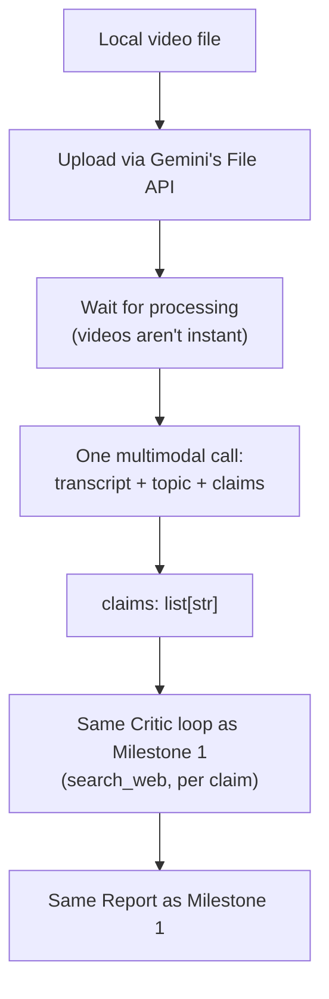

# Milestone 2 — Video Understanding (LLD)

**Status:** Done · **Depends on:** Milestone 1 · **Produces:** `backend/app/agents/video_planner.py`

## What this milestone proves

The exact same question Milestone 1 answered for typed text, now for a
real video file: does Gemini's native video understanding actually work
well enough to pull out a transcript, a topic, and checkable claims — in
one call — that the existing Critic pipeline can then verify unchanged?

## Explicitly not in scope here

**Relevance scoring/gating is not built in this milestone.** That means
comparing "what the video is actually about" against "the topic the
uploader tagged it with" — and there's no upload flow or topic tag to
compare against yet (that arrives with real uploads at Milestone 4/6).
Building a threshold check against nothing to check it against would be
scope creep. This milestone only captures the *topic* as raw information
(useful later), it doesn't judge anything with it yet.

## How it works

1. **Upload** — Gemini needs the video uploaded through its File API first
   (not sent as raw bytes inline) — this is the documented, robust path
   for anything beyond a tiny file.
2. **Wait for processing** — unlike a text prompt, a video needs
   server-side processing before it can be used (Gemini samples frames and
   audio from it). We poll until it's ready, capped at a timeout so a
   stuck upload can't hang forever — the same "always cap a loop" habit as
   everywhere else in this project.
3. **One multimodal call** — same idea as Milestone 1's Planner, except
   the input is the uploaded video instead of text, and it returns three
   things at once: a short transcript/summary, the general topic, and up
   to 3 checkable claims.
4. **Everything downstream is unchanged** — the claims list gets handed to
   the exact same `investigate_claim` function from Milestone 1. If this
   needs no changes, that's a good sign the Milestone 1 architecture was
   actually right: it never needed to know *where* claims came from.

## Files touched

| File | Change |
|---|---|
| `backend/app/agents/models.py` | Add one new model: `VideoUnderstanding` (transcript, topic, claims) |
| `backend/app/agents/video_planner.py` | **New.** Uploads the video, waits for processing, makes the one structured multimodal call |
| `backend/app/agents/pipeline.py` | Add `run_verification_from_video()` — same shape as `run_verification()`, video in instead of text in |
| `backend/app/cli.py` | Add a `--video PATH` option (alternative to typing text) |
| `backend/tests/fixtures/` | **New folder** — where a real short test clip goes (gitignored; test videos aren't source code) |

## Honest cons / open risks

- Gemini's exact video length/size limits for this model haven't been
  confirmed empirically yet — this milestone's real test doubles as
  finding that out.
- Video processing costs more (tokens and wall-clock time) than a text
  call — fine for occasional testing now, a real cost to design around
  once uploads are frequent (relevant again at Milestone 8's production
  hardening).
- One clip is a smoke test, not proof the prompt handles every kind of
  video well (a talking-head claim video vs. a fast-cut montage vs.
  something with no speech at all would likely need prompt tuning) —
  expected to need iteration once we see it run on more than one clip.

## Definition of done

- [x] A real local video file, pointed to via `--video`, produces a full
      Report the same way typed text does
- [x] The transcript/topic/claims extracted are reasonable for what's
      actually in the clip
- [x] No changes were needed to `critic.py` or the `Verdict`/`Report`
      shapes from Milestone 1

## What actually happened, building this

- **Worked on the first real test, no model swap needed** — the same
  `gemini-3.5-flash-lite` model used everywhere else in the app handled
  video input fine (upload → wait → one structured call), so the "might
  need a different model for video" risk noted above didn't materialize.
- **The real test clip doubled as a good demo of the whole point of this
  project.** The test video said "dinosaurs are already extinct" — true
  in the everyday sense, but the Critic's search surfaced that birds are
  classified as surviving dinosaurs, so it landed on **Mixed Evidence**
  with a real, sourced explanation instead of a lazy flat "true." That's
  exactly the behavior the credibility system is supposed to have.
- **Confirms the Milestone 1 architecture was right**: swapping the input
  source from text to video only required a new "planner"
  (`video_planner.py`) — `critic.py` and the `Verdict`/`Report` data
  shapes didn't change at all. The Critic never needed to know where a
  claim came from.
