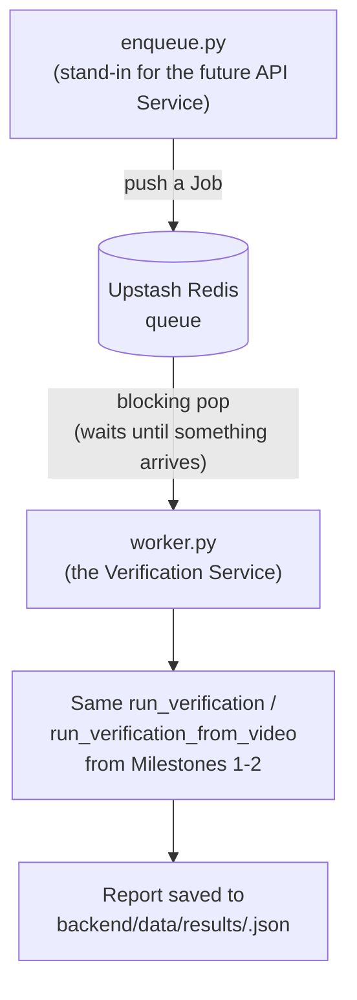

# Milestone 3 — Verification Service (LLD)

**Status:** Done · **Depends on:** Milestones 1–2 · **Produces:** `backend/app/jobs/`, `backend/app/worker.py`, `backend/app/enqueue.py`

## What this milestone proves

The first genuine service boundary in the project (ADR 0003): the
verification pipeline becomes a real, independently-runnable process that
sits and waits for jobs, instead of something only invoked directly by a
CLI argument. Nothing about the Planner/Critic pipeline itself changes —
only how it gets triggered.

## Why a hosted queue, not something local

Once the API Service and Verification Service are deployed separately
(Milestone 4+), they won't share a filesystem or process space — anything
that isn't reachable over the network (a local file, a local SQLite
database) would work on one laptop today and quietly break the moment
they're two separate deployments. So the queue has to be a real, hosted,
network-reachable thing from the start. See the decision log for the
options considered.

## How it works

1. **`enqueue.py`** — a small stand-in for what the real API Service will
   do at Milestone 4: take some text or a video path, wrap it in a `Job`
   (an id plus what to check), and push it onto the queue. It returns
   immediately after queuing — it does not wait for a result, matching how
   the real API Service will behave (ADR 0003: never block the request on
   slow verification work).
2. **The queue (Upstash Redis)** — the hand-off point. A list in Redis;
   `enqueue.py` pushes onto one end, `worker.py` blocks waiting to pop
   from the other end.
3. **`worker.py`** — the actual Verification Service. Runs forever: wait
   for a job, process it with the *exact same* Milestone 1/2 pipeline
   functions, save the result, wait for the next one. This is the piece
   that would actually get deployed as its own service later.
4. **Results** — saved as a JSON file per job under
   `backend/data/results/`. This is a deliberate, temporary stand-in —
   Milestone 4 replaces it with a real row in Supabase Postgres once that
   exists. The processing logic itself won't need to change, only where
   the finished `Report` gets written.

## New account you'll need

**Upstash** (the queue) — sign up free at upstash.com, create a Redis
database, and grab its **Redis URL** (the `rediss://...` connection
string — not the REST URL/token, since we want real blocking pop
behavior, not manual polling). Goes into `.env` as `REDIS_URL`.

## Files this creates

| File | Job |
|---|---|
| `backend/app/jobs/models.py` | The `Job` shape: an id, whether it's text or video, and the content |
| `backend/app/jobs/queue.py` | `enqueue(job)` and a blocking `listen()` wrapping Upstash Redis |
| `backend/app/worker.py` | The Verification Service itself — the long-running loop |
| `backend/app/enqueue.py` | The CLI stand-in for "what the API Service will eventually do" |
| `backend/app/core/config.py` | Add `get_redis_url()` |
| `backend/tests/test_job_queue.py` | A fast round-trip test (enqueue → dequeue, no LLM calls) — separate from the slower golden-set tests |

## Honest cons / open risks

- Results-as-JSON-files is explicitly throwaway, not a design to be proud
  of — it exists only so this milestone is testable before Postgres
  exists. Called out here so it isn't mistaken for a real decision later.
- `enqueue.py` is a stand-in, not the real API — it exists purely to prove
  the queue/worker boundary works before Milestone 4 builds the real
  producer of jobs.
- One worker process handling jobs one at a time is fine for proving the
  concept; real concurrency/scaling of the Verification Service is a
  Milestone 8 (production hardening) concern, not this one.

## Definition of done

- [x] `python -m app.worker` runs and sits waiting for jobs
- [x] `python -m app.enqueue "<text>"` (or `--video <path>`) returns
      immediately after queuing
- [x] The running worker picks up that job, processes it, and writes a
      result file — without the two processes sharing anything except the
      queue
- [x] The round-trip queue test passes

## What actually happened, building this

- **Credential detour:** the first Upstash credentials provided were its
  REST API URL/token, not the raw Redis connection string the design
  called for. REST doesn't support blocking waits at all, so the code was
  briefly adapted to polling as a fallback — then reverted back to the
  original blocking design once the actual `rediss://` connection string
  (from the same database's Details page) was available. Worth knowing
  Upstash exposes both interfaces to the same database.
- **A real redis-py gotcha:** the worker crashed on its very first
  `BRPOP` call with a low-level `TimeoutError`, not a clean "no job yet."
  Cause: the connection's own socket read timeout was shorter than (or
  equal to) `BRPOP`'s blocking timeout, so the socket gave up before the
  server had a chance to reply cleanly. Fixed by setting `socket_timeout`
  comfortably longer than the blocking call's own timeout, and by treating
  that specific timeout exception as "no job" rather than letting it
  crash the worker loop.
- **Post-roadmap fix, found by the worker actually running for a while:**
  after the whole roadmap was declared complete, a background worker that
  had been left running crashed with `redis.exceptions.ConnectionError:
  ... An existing connection was forcibly closed by the remote host`
  (Windows error 10054) on a later `BRPOP` call — a cloud Redis
  connection over TLS getting reset mid-session is a real, known failure
  mode, not a hypothetical one, and it only showed up because the process
  had been alive long enough for it to happen (short demo runs never hit
  it). `listen()` in `worker.py`'s main loop was the one place in the
  whole service with **no** exception handling around it — any Redis
  hiccup there took down the entire process, not just that one call.
  Fixed by wrapping it in a try/except that logs, waits briefly, and lets
  the next iteration get a fresh connection from the pool, rather than
  crashing. Same trip also made `publish_progress()` (Milestone 7b) fail
  open like the search cache already did — a progress-narration hiccup
  should never be able to crash the worker either.
- **A real logging gotcha:** the worker's `print()` output didn't appear
  in real time — Python fully buffers stdout (rather than flushing per
  line) when it isn't attached to a real terminal, which a background
  service's redirected output isn't. Fixed with `flush=True` on every log
  line. Easy to miss locally, would have been confusing in a real deployed
  service's logs.
- **Confirmed the actual point of the milestone**: `enqueue.py` and
  `worker.py` share nothing but the Upstash queue — no shared memory, no
  shared filesystem, no direct function call between them. That's the
  real requirement for Milestone 4, when they become two separately
  deployed services.
