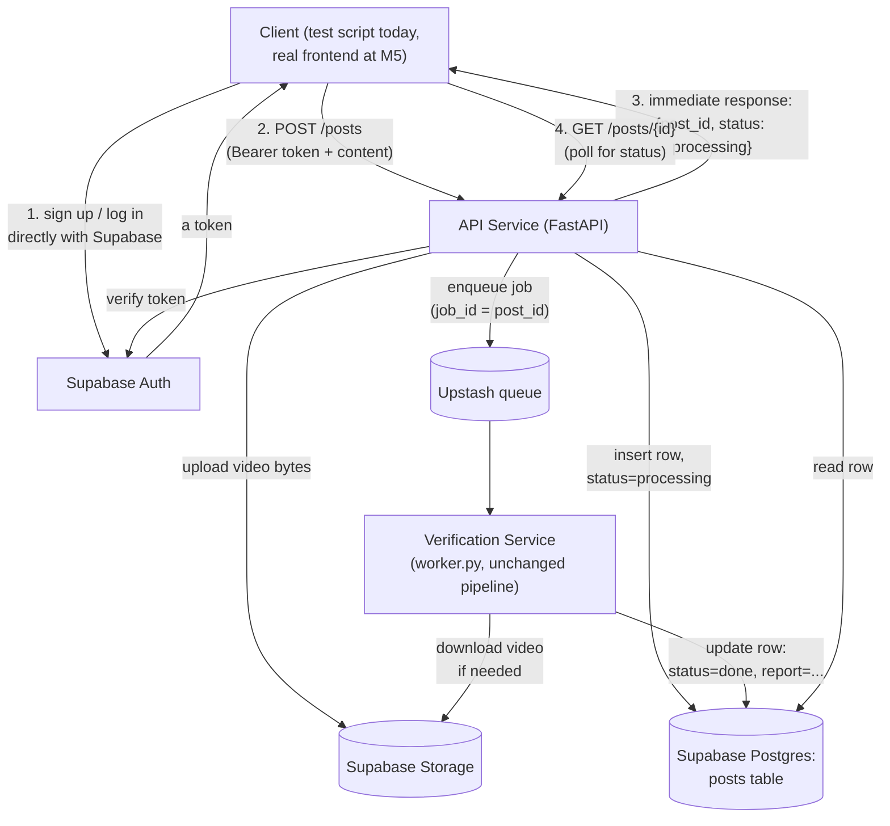

# Milestone 4a — API Service + Supabase (LLD)

**Status:** Done · **Depends on:** Milestone 3 · **Produces:** `backend/app/api/`, `backend/app/db/`, Supabase project

## What this milestone proves

Real uploads from a real, authenticated user, persisted for real — and the
API Service and Verification Service now talking to each other only
through the queue and a shared database, exactly like two independently
deployed services would (even though today they still happen to run on
one laptop).

## Explicitly not in scope here

**No publish/reject decision yet.** A post finishes processing with its
full credibility report attached and a status of `done` — it doesn't yet
get judged against its declared topic or turned into a publish/reject
verdict. That's Milestone 4b, on purpose: it's a different kind of work
(a judgment call and a decision rule) layered on top of infrastructure
that needs to be solid first.

**No sign-up/login endpoints in our own API.** The standard way Supabase
apps work: whatever calls this API (today: a test script; from Milestone
5: the real frontend) talks to Supabase Auth *directly* to get a token,
then sends that token to us. Our job is only to verify it, not issue it.

## How it works



1. **Auth happens outside our API.** A client gets a Supabase-issued token
   on its own; our API only ever *verifies* one, via Supabase's own
   `auth.get_user(token)` call — not hand-rolled JWT signature checking.
   That's a deliberate choice: verifying a cryptographic signature
   yourself is exactly the kind of thing that's easy to get subtly wrong,
   and the one extra network call this costs is a fine trade for not
   owning that risk.
2. **`POST /posts`** — the only real "write" endpoint. Stores the upload
   (video bytes to Supabase Storage; text stored directly), inserts a
   `posts` row with `status = "processing"`, enqueues a job using the
   **post's own id as the job id** (so the worker always knows exactly
   which row to update — no separate id-mapping needed), and returns
   immediately. It never waits for verification to finish.
3. **The worker changes in two small, specific ways:**
   - Results now get written as an `UPDATE` to the `posts` row instead of
     a local JSON file — the one planned change flagged back in Milestone
     3's doc.
   - For video jobs, the content is now a *Supabase Storage path*, not a
     local file path (uploads happen on the API Service's machine; the
     worker is a separate process that can't see that machine's temp
     files — a real consideration now, not a hypothetical one, since these
     become genuinely separate deployments at scale). The worker
     downloads the video from Storage to its own temp file first, then
     hands that local path to the *unchanged* `understand_video()` from
     Milestone 2.
   - Everything else in the worker — the pipeline functions themselves —
     doesn't change at all.
4. **`GET /posts/{id}` and `GET /posts`** — read-only, lets a client check
   on a post's status or list their own posts. Needed to actually verify
   this milestone works without a frontend yet.

## Database

One table, created via SQL run directly in Supabase's SQL editor (kept as
a checked-in reference at `backend/app/db/schema.sql`, even though it's
applied manually for now — a real migration tool is a fine later
improvement, not needed yet):

```sql
create table posts (
  id uuid primary key,
  user_id uuid not null references auth.users(id),
  kind text not null check (kind in ('text', 'video')),
  content text not null,           -- raw text, or a Supabase Storage path
  declared_topic text,             -- captured now for Milestone 4b, unused until then
  status text not null default 'processing',  -- processing | done | failed
  report jsonb,                    -- the Report (+ VideoUnderstanding for video) once done
  created_at timestamptz not null default now()
);
```

**Authorization for now: enforced in the API layer, not fine-grained
Postgres Row Level Security policies.** The API Service uses Supabase's
service-role key (bypasses RLS entirely) and checks `user_id` matches the
requester itself in each endpoint's own code. RLS is still turned **on**
for the table with zero policies defined — Supabase's default in that
state is to deny all access through its public (`anon`-key) API, so this
costs nothing and closes off direct access to the table if that key ever
leaked, without needing real per-row policies yet. Writing actual granular
policies (for if a frontend ever queries Supabase directly instead of
through our API) is a legitimate later step, not needed now.

## `enqueue.py` gets simpler, on purpose

Its `--video` option is removed. Video jobs now have to go through the
real API (to land in Supabase Storage first) — there's no longer a
meaningful "just point at a local file" shortcut once the worker expects
a storage path for video jobs. `enqueue.py --text` (renamed from the bare
positional, for clarity now that video is gone) still exists purely to
test the worker/queue mechanics in isolation, without needing the full
API+auth+storage stack running.

## New account you'll need

**Supabase** — one free project at supabase.com bundles Storage,
Postgres, and Auth together (no separate signups this time). Two setup
steps once it exists:
1. Run the SQL above in the SQL editor.
2. Create a Storage bucket named `videos`.

## Files this creates/changes

| File | Job |
|---|---|
| `backend/app/db/supabase_client.py` | **New.** Lazy Supabase client, same pattern as the Tavily/Redis clients |
| `backend/app/db/schema.sql` | **New.** The table definition, checked in for reference |
| `backend/app/api/auth.py` | **New.** `get_current_user` — verifies the bearer token via Supabase |
| `backend/app/api/main.py` | **New.** The FastAPI app: `POST /posts`, `GET /posts/{id}`, `GET /posts` |
| `backend/app/worker.py` | **Changed.** Results go to Postgres; video jobs download from Storage first |
| `backend/app/enqueue.py` | **Simplified.** Text-only now, for the reason above |
| `backend/scripts/create_test_user.py` | **New.** One-off helper: signs up/logs in a test user, prints a token to test the API with, since there's no frontend yet |

## Honest cons / open risks

- No RLS yet — a real security layer intentionally deferred, not forgotten (see above).
- Supabase projects sometimes require email confirmation before a
  sign-up produces a usable session — may need a project setting change
  to get a test token easily; we'll hit this empirically rather than
  guess at it in advance.
- One FastAPI process and one worker process, both reading `backend/.env`
  locally — fine for now; becomes two separately-configured deployments
  at Milestone 8, not this one.

## Definition of done

- [x] A test user can be created and produces a usable token
- [x] `POST /posts` with a text claim returns immediately with a `post_id`
- [x] `POST /posts` with a video file stores it in Supabase Storage and
      returns immediately
- [x] The running worker picks up both kinds of jobs from real API
      requests and updates the Postgres row when done
- [x] `GET /posts/{id}` reflects `processing` then `done`, with the real report attached
- [x] A request without a valid token is rejected

## What actually happened, building this

- **RLS decision improved mid-build:** Supabase's SQL editor warned about
  creating a table without RLS. Turned out enabling RLS with *zero*
  policies is strictly better than not enabling it at all here — it
  defaults to denying all access through the public (`anon`-key) API,
  while our service-role key (which bypasses RLS regardless) keeps working
  exactly the same. Free security improvement, not a trade-off — see the
  Authorization section above, corrected from the original plan.
- **A real Supabase Auth quirk:** signing up `trustfeed.test@example.com`
  was rejected as an "invalid" email — `example.com` is specifically
  recognized as a placeholder domain and blocked. Switching to a
  `gmail.com`-style address worked fine without needing a real inbox.
- **Email confirmation had to be turned off** for a test sign-up to
  produce a usable session immediately, as anticipated in the LLD's risk
  section — confirmed exactly as expected, not a surprise.
- **A real API design bug caught by testing, not guessed:** a request
  with *no* `Authorization` header at all returned FastAPI's generic 422
  ("required field missing") instead of 401 — technically "rejected" but
  the wrong status code for an auth failure. Fixed by making the header
  optional at the FastAPI level and raising 401 explicitly for both
  "missing" and "malformed", so every auth failure looks the same to a
  client.
- **Confirmed the storage-path design works end-to-end:** the video job's
  `content` field in the database correctly holds the Supabase Storage
  path (e.g. `<user_id>/<post_id>/<filename>`), and the worker
  successfully downloaded from Storage into its own temp file before
  handing it to the unchanged Milestone 2 `understand_video()` — proving
  the API Service and Verification Service genuinely don't need to share
  a filesystem.
