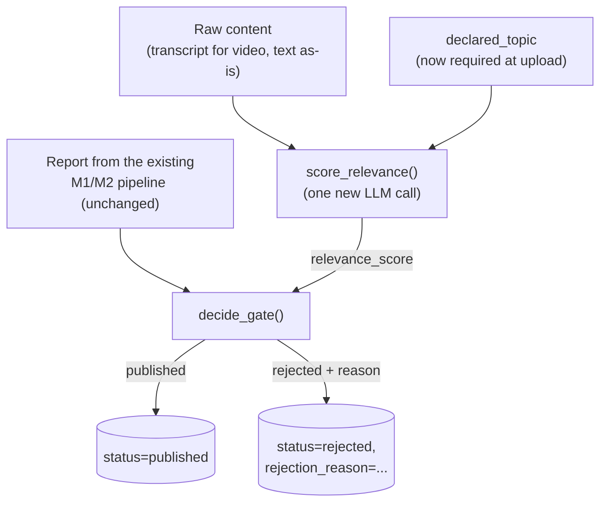

# Milestone 4b — The Publish/Reject Gate (LLD)

**Status:** Done · **Depends on:** Milestone 4a · **Produces:** `backend/app/agents/relevance.py`, `backend/app/agents/gate.py`

## What this milestone proves

The actual core idea of the product: a post only reaches "published" if it
earns it. Until now, every post that finished processing just sat at
`status = "done"` regardless of whether it made sense or held up — this
milestone is where that stops being true.

## How it works



1. **`score_relevance()`** (new) — one structured-output call, same pattern
   as everything else in this project: given the declared topic and the
   actual content (a video's transcript, or the raw text for text posts),
   returns a 0–100 relevance score and a short reason. This is genuinely
   new logic, not a repurposing of Milestone 1/2's Planner/Critic.
2. **`decide_gate()`** (new) — a small, pure function (no I/O, no API
   calls) that takes the relevance score and the list of per-claim
   `Verdict`s and returns a decision:
   - **Rejected** if the relevance score is below a threshold, **or** any
     claim is labeled `Unsupported` (the strict rule — `Mixed Evidence`
     and `Unable to Verify` don't fail a post; zero claims auto-passes
     credibility, since there's nothing to dispute).
   - **Published** otherwise.
   - Being a pure function with no side effects, this is fast and free to
     test directly with hand-built `Verdict` objects — no LLM calls needed
     for its own test coverage.
3. **The worker** calls both after its existing processing step, then
   writes `status`, `relevance_score`, and (if rejected) `rejection_reason`
   to the post's row — the *existing* M1/M2 pipeline functions and the
   `Verdict`/`Report` shapes don't change at all.
4. **`declared_topic` becomes required** in `POST /posts` (Milestone 4a's
   endpoint) — the whole gate is meaningless without it.

## Database changes

```sql
alter table posts add column relevance_score integer;
alter table posts add column rejection_reason text;
```

`status` keeps its column type but its meaning grows:
`processing` → `published` **or** `rejected` (previously just `done`), or `failed` (unchanged, for real errors).

## Honest cons / open risks

- The relevance threshold (proposed default: 50) and the strict
  credibility rule are both judgment calls, not validated against real
  usage — expected to need tuning once there's more than a handful of
  test posts to look at. Flagged, not hidden.
- "Published" doesn't actually *do* anything different from "rejected"
  yet, in terms of what's visible where — there's no feed to filter until
  Milestone 5/6. This milestone proves the decision is made and recorded
  correctly, not that it changes what anyone sees yet.
- A single relevance score from one LLM call is simpler than embeddings
  but inherits whatever quirks that call has (same category of risk as
  Milestone 1's Critic occasionally hedging on borderline cases) — worth
  watching once more real posts run through it.

## Definition of done

- [x] `POST /posts` rejects an upload with no `declared_topic`
- [x] A post genuinely relevant to its tag with all-supported claims ends
      at `status = "published"`
- [x] A post tagged with an unrelated topic ends at `status = "rejected"`
      with a `rejection_reason` mentioning relevance
- [x] A post containing an `Unsupported` claim ends at `status = "rejected"`
      with a `rejection_reason` mentioning the claim, even if perfectly on-topic
- [x] `decide_gate()` has fast, no-LLM-call unit tests covering: both gates
      pass, relevance fails, credibility fails, zero claims auto-passes credibility

## What actually happened, building this

- **Live test confirmed both gates work independently, exactly as
  designed:** a real Apollo 11 claim tagged `space` published (relevance
  100); the same true claim mistagged `cooking` was rejected on relevance
  alone (relevance 0); a fabricated "Moon landing was staged" claim
  correctly tagged `space` was rejected on credibility alone (relevance
  90 — correctly recognizing it *was* about space — but the false claim
  still failed it). That's the two-gate design doing its actual job: a
  post can fail for either reason independently, and the stored
  `rejection_reason` says which.
- **A genuinely-missing form field returning 422 is correct, unlike the
  Milestone 4a auth case.** Considered "fixing" `declared_topic` validation
  to return a clean 400 the same way the auth header was fixed, then
  realized the two situations aren't the same: a missing `Authorization`
  header is an authentication failure (401 is the correct HTTP semantic),
  while a missing required form field is exactly what 422 exists for.
  Left as FastAPI's default behavior — a good example of not applying a
  fix mechanically just because a similar-looking issue was fixed before.
- **Old jobs already sitting at `status = "failed"` don't retry
  automatically** — before the schema migration was run, three test posts
  failed with a real Postgres error (`Could not find the 'rejection_reason'
  column`). Once the migration was applied, those specific jobs stayed
  failed (already consumed off the queue) — had to submit fresh posts to
  test, not just re-check the old ones. Worth remembering: this worker has
  no retry mechanism yet (a fine gap for a solo MVP, a real one for
  Milestone 8's production hardening).
