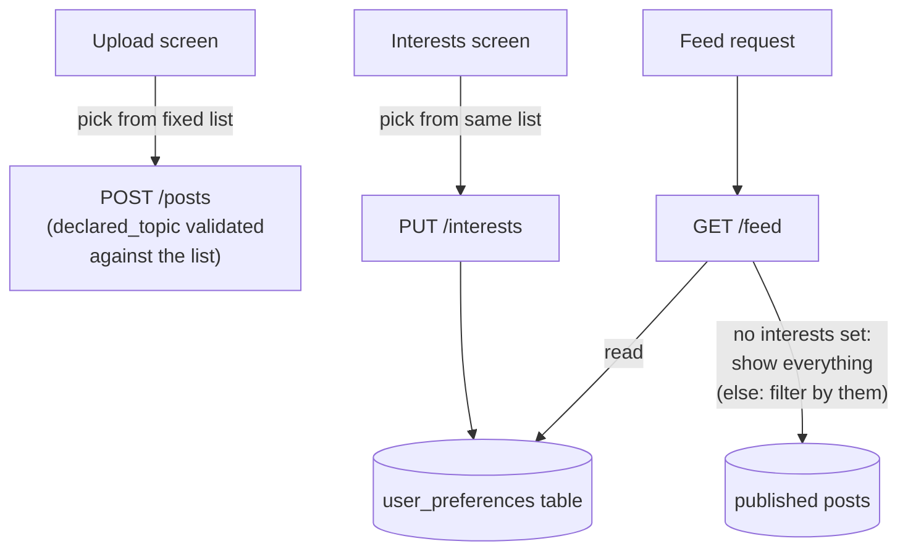

# Milestone 6 — Interest-Based Filtering (LLD)

**Status:** Done · **Depends on:** Milestone 5 · **Produces:** `backend/app/core/topics.py`, `GET/PUT /interests`, `frontend/src/screens/InterestsScreen.tsx`

## What this milestone proves

The "feed" idea properly: what you see depends on what you actually chose
to see, not the same undifferentiated list every viewer gets. Deliberately
not a recommender system — no behavioral tracking, no ML ranking, just
"show me posts tagged with topics I picked."

## The decision that makes this simple

A **fixed list of ~12 topics**, shared by both tagging a post and picking
interests, replaces the freeform topic text field from Milestone 4. Exact
string matching then works perfectly — the alternative (freeform text +
embedding similarity) is the technically "more correct" tool for matching
one viewer against many posts, but it's new infrastructure this project
doesn't need yet for a 12-category problem. Worth revisiting if the topic
list ever needs to grow into something genuinely open-ended.

**The list:** space, science, history, nutrition, technology, wildlife,
sports, politics, finance, health, psychology, culture.

## How it works



- **No interests selected yet → unfiltered feed.** A brand-new user
  isn't shown an empty feed just because they haven't visited Settings —
  filtering only kicks in once they've actually picked at least one
  interest.
- **`declared_topic` validation moves from "any non-empty string" to
  "must be one of the fixed list"** — the one change to Milestone 4a's
  upload endpoint.

## Database

```sql
create table user_preferences (
  user_id uuid primary key references auth.users(id),
  topics text[] not null default '{}'
);
```

## Files

| File | Job |
|---|---|
| `backend/app/core/topics.py` | The shared fixed list (single source of truth on the backend) |
| `backend/app/api/main.py` | `declared_topic` validation change; `GET /interests`, `PUT /interests`; `GET /feed` filters by the caller's topics when set |
| `frontend/src/lib/topics.ts` | The same fixed list, mirrored for the frontend |
| `frontend/src/screens/InterestsScreen.tsx` | Multi-select picker, reachable via a settings icon from Upload/My Posts (not a 5th bottom tab — keeps the approved tab bar design intact) |
| `frontend/src/screens/UploadScreen.tsx` | Topic field becomes a `<select>` from the fixed list, not free text |

## Honest cons / open risks

- Existing freeform-tagged test posts from earlier milestones won't
  match any interest filter until retagged — fine, they're test data.
- A 12-category list is a real constraint on what a post can be tagged
  as; a real product would likely want this to grow, which reopens the
  embeddings question later, not now.
- No way to reach Interests directly from the Feed tab (which has no
  header, by design, to stay immersive) — one extra tap through Upload
  or My Posts first. Acceptable trade-off, not a bug.

## Definition of done

- [x] Uploading now requires picking a topic from the fixed list, not typing one
- [x] A user with no interests set still sees the full feed
- [x] Selecting interests and saving actually changes what the feed shows
- [x] Confirmed working in a real browser

## What actually happened, building this

- **Verified via curl before the browser check, and it caught something
  real:** with interests cleared back to empty, the feed correctly showed
  every published post again -- including a post tagged `Dinosaur`
  (capitalized, singular) sitting alongside one tagged `dinosaurs`
  (matches the fixed list). That's a leftover from testing *before* this
  milestone added `declared_topic` validation, not a bug -- exactly the
  known limitation called out in the LLD ("existing freeform-tagged test
  posts won't match any interest filter until retagged"), now seen for
  real instead of just anticipated.
- No other surprises -- the fixed-vocabulary decision paid off exactly as
  expected: exact-match filtering worked correctly on the first real
  test, no embedding infrastructure needed.
