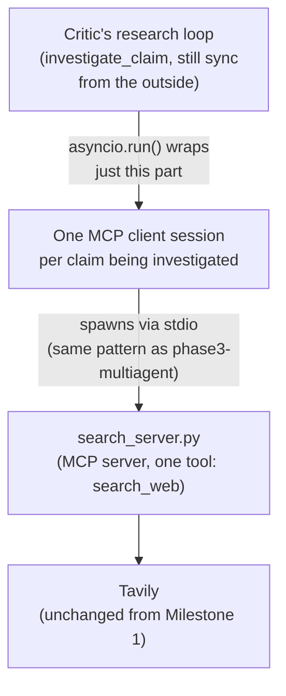

# Milestone 7a — MCP Tool Server (LLD)

**Status:** Done · **Depends on:** Milestone 1 · **Produces:** `backend/app/mcp/search_server.py`

## What this milestone proves

The Critic's one tool (`search_web`) moves from a plain Python function
call to a real MCP server the Critic talks to as a client — the same
architectural step `phase3-multiagent` took in the learning roadmap
(inline tool → tools served over MCP), applied to this project's real
verification pipeline instead of a toy example.

## How it works

1. **`search_server.py`** — a small MCP server exposing exactly one tool,
   `search_web`, implemented by calling the *existing, unchanged*
   `search_web()` function from Milestone 1's `search_tool.py`. This
   server doesn't know anything new about search — it's a thin MCP
   wrapper around logic that already works.
2. **One MCP session per claim, not per search call.** A claim's
   research loop might search 1-3 times; spawning a fresh subprocess for
   every individual search would be wasteful. The session opens once at
   the start of investigating a claim and is reused for every search
   within that claim's loop.
3. **`investigate_claim()`'s public signature doesn't change** — it's
   still a plain synchronous function from the outside (`pipeline.py`,
   `worker.py`, and every test that calls it need zero changes). Only
   its *internal* implementation changes: the part that talks to
   `search_web` now does so via `asyncio.run()` wrapping an async MCP
   client session, instead of calling the function directly. This is the
   same "swap the internals, keep the interface" pattern used successfully
   in every prior milestone (video vs. text input, worker vs. CLI).

## Files

| File | Job |
|---|---|
| `backend/app/mcp/search_server.py` | **New.** The MCP server — one tool, `search_web`, wrapping the unchanged Milestone 1 function |
| `backend/app/agents/critic.py` | **Changed internally only.** The research loop's tool-calling step goes through an MCP client session instead of a direct function call |

## Honest cons / open risks

- Spawning a subprocess per claim adds real latency (process startup) on
  top of what's already there — acceptable for a demo, a real
  optimization target if this pipeline ever needed to be fast at scale.
- This is architectural depth, not a user-visible change — nothing about
  what a post's verdict looks like changes. Its value is entirely in "how
  it's built," which is exactly what it's for.

## Definition of done

- [x] `investigate_claim()` still produces correct verdicts — the golden
      set (`tests/test_golden_set.py`) passes unchanged
- [x] The search step is confirmed to actually be going through the MCP
      server (not silently falling back to a direct call)
- [x] No other file needed to change to make this work

## What actually happened, building this

- **A real subprocess/import path bug:** the first attempt spawned the
  MCP server by its script path (`python .../search_server.py`), which
  failed with `ModuleNotFoundError: No module named 'app'` — running a
  script directly only puts *that script's own directory* on `sys.path`,
  not the `backend/` directory the `app` package lives under. Fixed by
  invoking it as a module instead (`python -m app.mcp.search_server`)
  with `cwd` set explicitly to `backend/` via `StdioServerParameters`'
  `cwd` argument -- module invocation adds the current working directory
  to `sys.path`, which script-path invocation doesn't.
- **"Confirmed going through MCP" turned out to be structural, not just
  tested:** `critic.py` no longer imports `search_web` at all, only the
  MCP client plumbing -- there's no code path left that *could* silently
  fall back to a direct call. The passing golden-set run is confirming
  behavior, but the file itself is what actually guarantees it.
- **The golden-set failures on this run were a red herring, not a
  regression:** 3 of 7 claims failed with a `429 RESOURCE_EXHAUSTED` from
  Gemini's free-tier rate limit (15 requests/minute) -- a side effect of
  how much cumulative testing this session has run today, not anything
  wrong with the MCP conversion. Waiting briefly and re-running just
  those three confirmed all 7 pass. Worth remembering: a golden-set
  failure isn't automatically a real bug -- check the actual error first.
