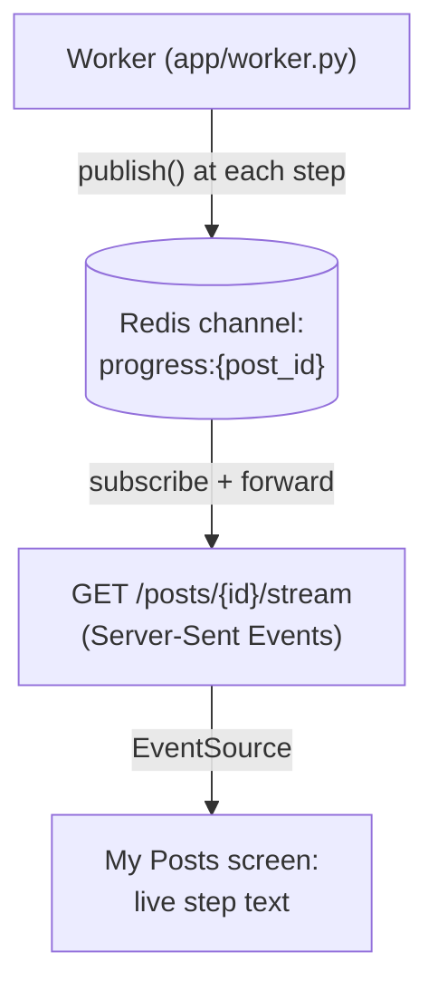

# Milestone 7b — Live Agent-Step Streaming (LLD)

**Status:** Done · **Depends on:** Milestone 7a · **Produces:** `backend/app/jobs/progress.py`, `GET /posts/{id}/stream`, `frontend` live-progress display

## What this milestone proves

Instead of a static "Processing" spinner, My Posts shows *what the
pipeline is actually doing right now* — "Extracting claims...",
"Researching claim 2 of 3: ...", "Scoring relevance to 'space'..." — as it
happens. This is the single most demo-impressive moment in the project:
most candidates show a chatbot; this shows agents thinking out loud.

## How it works

1. **The worker publishes a short message to a per-post Redis channel**
   at each meaningful step — extracting claims, starting research on each
   claim, scoring relevance, making the final decision. Reuses the
   already-integrated Upstash Redis; no new infrastructure.
2. **`on_progress` is an optional callback threaded through the pipeline
   functions** (`run_verification`, `run_verification_from_video`,
   `_build_report`) — defaults to `None` everywhere, so `cli.py`,
   `enqueue.py`, and every existing test call these functions completely
   unchanged. Only `worker.py` passes a real callback.
3. **`GET /posts/{id}/stream`** — a Server-Sent Events endpoint. Checks
   the post's *current* status first: if it's already finished by the
   time a client connects, it immediately says so and closes instead of
   waiting on a channel nothing will ever publish to again (pub/sub has
   no history — a message published before you subscribed is gone).
   Otherwise it subscribes to that post's Redis channel and forwards
   messages as they arrive, until the worker's sentinel end-of-stream
   message tells it to close.
4. **Auth wrinkle, accepted deliberately:** browsers' native
   `EventSource` can't send an `Authorization` header, so this one
   endpoint reads the access token from a query parameter instead. A
   short-lived session token appearing in a URL (server logs, browser
   history) is a minor, accepted trade-off here — this isn't a long-lived
   secret, and it's the standard, well-known workaround for this exact
   browser limitation.
5. **Polling from Milestone 5 stays as the reliable fallback.** Live
   streaming is a nice-to-have for the *demo moment*; if an SSE
   connection drops or never connects, the existing 4-second poll still
   catches the real status change. Streaming failing should never mean a
   post looks stuck.

## Files

| File | Job |
|---|---|
| `backend/app/jobs/progress.py` | **New.** `publish_progress()` (sync, called by the worker) and `subscribe_progress()` (async generator, called by the API) |
| `backend/app/agents/pipeline.py` | Add an optional `on_progress` callback, threaded through claim extraction and the per-claim research loop |
| `backend/app/worker.py` | Passes a real `on_progress` callback; emits its own steps (downloading video, scoring relevance, deciding); publishes the end-of-stream sentinel after saving the result |
| `backend/app/api/main.py` | New `GET /posts/{id}/stream` endpoint |
| `backend/app/api/auth.py` | Small refactor: the token-verification logic is shared between the header-based and query-param-based cases |
| `frontend/src/lib/api.ts` | A way to get the current access token for building the stream URL |
| `frontend/src/screens/MyPostsScreen.tsx` | Shows live step text (via `EventSource`) instead of the static "Checking relevance and sources..." while a post is processing |

## Honest cons / open risks

- No message history — connecting late means missing everything already
  published, mitigated (not eliminated) by checking current status first.
- One Redis connection held open per active SSE stream — fine at demo
  scale, a real capacity question if this ever had many concurrent users
  watching their uploads process at once (a Milestone 8 concern).
- The progress messages are coarse-grained (per pipeline stage, not
  per-token) — deliberately so, to avoid threading a callback through
  every low-level agent function; this is "watch the agent's stages,"
  not "watch the LLM type."

## Definition of done

- [x] A freshly-submitted post's live step text visibly changes multiple
      times while it processes, without a page reload
- [x] Connecting to the stream for an already-finished post returns
      immediately instead of hanging
- [x] If the stream endpoint is never called at all, the post still ends
      up correctly published/rejected via the existing polling (unchanged
      from Milestone 5 — the SSE layer is purely additive)
- [x] Confirmed working in a real browser — My Posts visibly cycles
      through multiple live step messages before settling on the final
      status

## What actually happened, building this

- **Verified with curl before the browser check, and it demonstrated the
  documented limitation directly, not just in theory.** Uploading a post
  and immediately curling its stream endpoint only caught the *tail* of
  the messages ("Researching claim 2 of 2...", "Scoring relevance...",
  "Making final decision...") — the worker had already published the
  first few ("Extracting claims...", "Found 2 claim(s)...") before curl
  finished connecting. Pub/sub genuinely has no history; this is the LLD's
  documented risk, now confirmed as real behavior rather than a guess.
- **The end-of-stream sentinel worked exactly as designed**: the stream
  closed cleanly after the real messages, and `__DONE__` itself was never
  visible in the output — confirming the filtering in
  `subscribe_progress()` behaves correctly.
- **The "already finished" fast-path also confirmed correctly**:
  reconnecting to a post that had already resolved returned
  `Already published.` immediately instead of hanging on a channel
  nothing would ever publish to again.
